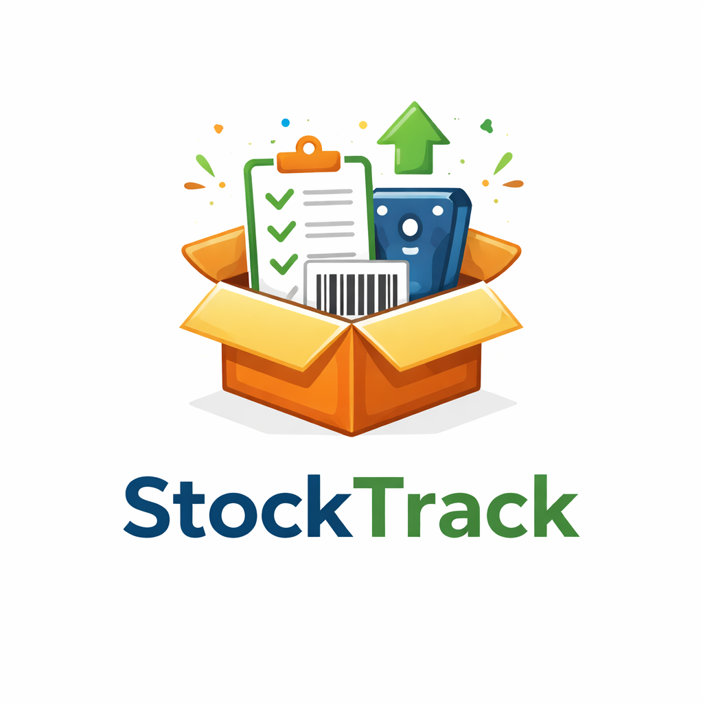

```markdown
# StockTrack — Inventory Management System

A lightweight, robust Inventory Management System built with **PHP** and **SQLite**. Designed for tracking assets with condition monitoring (New, Repaired, Faulty), transaction auditing, and mobile PWA support.



## 🚀 Features

### 📦 Inventory Management
- **Stock IN (Admin):** Add new items or replenish stock.
- **Stock OUT:** Dedup items when taken for use.
- **Condition Tracking:** Track items as **New**, **Repaired**, or **Faulty** separately (e.g., *HDMI Cable [New]* vs *HDMI Cable [Repaired]*).
- **Import/Export:** Bulk import items via CSV or export current stock for backups.
- **Soft Delete:** Items can be deleted (hidden) without losing historical data.
- **Delete All:** Admin option to wipe inventory while keeping logs.

### 🔍 Audit & History
- **Simple View:** See current stock levels and status (In Stock / Out of Stock).
- **History View:** Full transaction log (Who took what, when, and why).
- **Drill-Down:** Click any item to see its specific history and variant stocks.
- **Quick Actions:** Add or remove stock directly from the audit popup.
- **Filters:** Filter by Date Range, Condition, Status, or Search query.

### 📱 User Experience
- **Public Check:** Read-only page for anyone to search stock and print lists.
- **PWA Ready:** Installable on mobile and desktop (includes Service Worker & Manifest).
- **Responsive:** Optimized for mobile, tablet, and desktop screens.
- **Print Friendly:** Clean print layouts for stock lists and reports.

### 🛡️ Security & Roles
- **Admin:** Full access (Stock IN, Edit, Delete, User Management, Import/Export).
- **User:** Restricted access (Stock OUT, Audit View).
- **Security:** Password hashing (bcrypt), CSRF protection, and SQLite strict mode.

---

## 🛠️ Tech Stack
- **Backend:** PHP 8.2+ (No frameworks, pure vanilla PHP).
- **Database:** SQLite 3 (Zero configuration, file-based).
- **Frontend:** HTML5, CSS3 (Custom styles), Vanilla JavaScript.
- **Container:** Docker & Docker Compose.

---

## 🐳 Quick Start (Docker)

1. **Clone/Download** this repository.
2. **Run** with Docker Compose:
   ```bash
   docker compose up -d --build

```

3. **Open** in browser:
* **URL:** `http://localhost:8092`


### Default Credentials

| Role | Username | Password |
| --- | --- | --- |
| **Admin** | `admin` | `admin123` |
| **User** | `user` | `user123` |

---

## 🔧 Manual Installation (No Docker)

1. Ensure you have **PHP 8.0+** and the **php-sqlite3** extension installed.
2. Place the files in your web server directory (e.g., `/var/www/html` or `htdocs`).
3. Ensure the `data/` folder is writable by the web server:
```bash
mkdir data
chmod -R 775 data
chown -R www-data:www-data data

```


4. Navigate to `http://localhost/install.php` to initialize the database.
5. **Delete** `install.php` after installation for security.

---

## 📂 Project Structure

```text
StockTrack/
├── api/               # AJAX Endpoints (History, Search, Transact)
├── app/               # Core Logic (Auth, DB Connection, Layouts)
├── assets/            # CSS, JS, Images, PWA Manifest
├── data/              # SQLite Database (Created after install)
├── admin.php          # Admin Dashboard (Stock IN, Manage Items)
├── audit.php          # Audit & Inventory Views
├── export.php         # CSV Export Logic
├── import.php         # CSV Import Logic
├── index.php          # Homepage
├── public.php         # Public Stock Check
├── take.php           # Stock OUT Page
├── sw.js              # Service Worker (PWA)
└── ...

```

## ⚠️ Troubleshooting

**"Unable to open database file"**

* Ensure the `data/` folder exists and has write permissions.
* Docker users: Run `sudo chown -R 33:33 data`.

**"Foreign Key Constraint Failed"**

* This happens if you try to log a transaction for an item that doesn't exist. The application handles this, but if you manually edit the DB, ensure referential integrity.

---

## 📜 License

This project is open-source. Feel free to modify and distribute.
